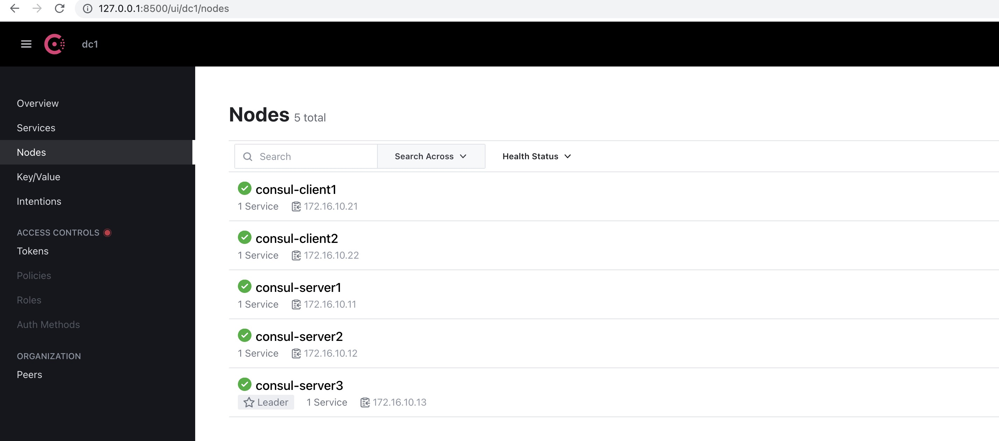
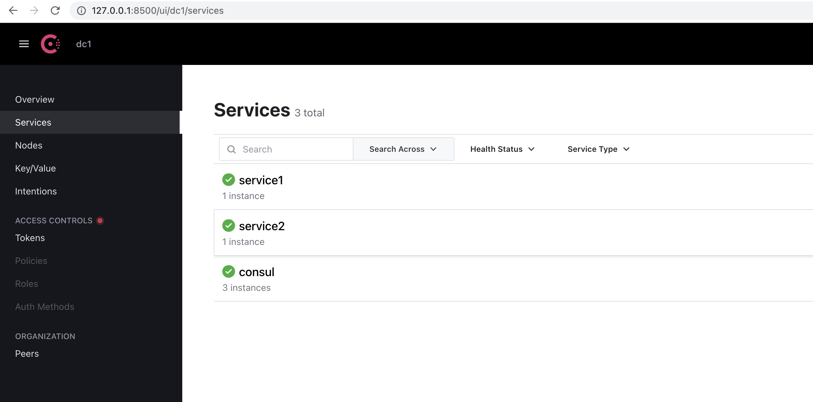

# consul-cluster
`consul-cluster` 可以快速启动3个server组成的cluster集群，以及运行2个 **consul client**

| Consul | IP |
| ------- | ------- |
| Server1| 172.16.10.11 |
| Server2 | 172.16.10.12 |
| Server3 | 172.16.10.13 |
| Client1 | 172.16.10.21 |
| Client2 | 172.16.10.22 |

进入**consul-cluster**目录, 运行 **docker-compose up -d**

```
CONTAINER ID   IMAGE                         COMMAND                  CREATED             STATUS             PORTS                                                                     NAMES
c170e624e4da   shen100/consul-nodejs:1.0.0   "consul agent -confi…"   About an hour ago   Up About an hour   8300-8302/tcp, 8600/tcp, 0.0.0.0:8500->8500/tcp, 0.0.0.0:3001->3000/tcp   consul-client1
c564b4455e9b   shen100/consul-nodejs:1.0.0   "consul agent -confi…"   About an hour ago   Up About an hour   8300-8302/tcp, 8500/tcp, 8600/tcp, 0.0.0.0:3002->3000/tcp                 consul-client2
3326dfb782a4   shen100/consul-nodejs:1.0.0   "consul agent -confi…"   About an hour ago   Up About an hour   8300-8302/tcp, 8500/tcp, 8600/tcp                                         consul-server2
f22f5e9c5449   shen100/consul-nodejs:1.0.0   "consul agent -confi…"   About an hour ago   Up About an hour   8300-8302/tcp, 8500/tcp, 8600/tcp                                         consul-server3
7d67b76f8a0f   shen100/consul-nodejs:1.0.0   "consul agent -confi…"   About an hour ago   Up About an hour   8300-8302/tcp, 8500/tcp, 8600/tcp                                         consul-server1
```

现在这个集群已经运行起来了，我们可以在浏览器里访问下consul的ui网页, 访问这个地址
```
http://127.0.0.1:8500
```

看下节点，我们有5个节点



进入 **consul-client1** 容器里
```
exec -it consul-client1 bash
```

再进到 **app** 目录,  安装依赖的nodejs模块，再运行**app.js**
```
cd app
npm i 
node app.js 
```

输出
```
Server listening on port 3000.
```

再新开一个命令行窗口，进入 **consul-client2** 容器里
```
exec -it consul-client2 bash
```

再进到 **app** 目录,  安装依赖的nodejs模块，再运行**app.js**
```
cd app
npm i 
node app.js 
```

输出
```
Server listening on port 3000.
```

现在我们的2个service 已经运行了，在浏览器里看下

可以看到2个我们自己的service, 以及**consul** 本身的service


浏览器里访问客户端1，即访问这个地址
```
http://127.0.0.1:3001/api/service
```

你将会看到页面显示文本 **service1**

浏览器里访问客户端2，即访问这个地址
```
http://127.0.0.1:3002/api/service
```

你将会看到页面显示文本 **service2**


